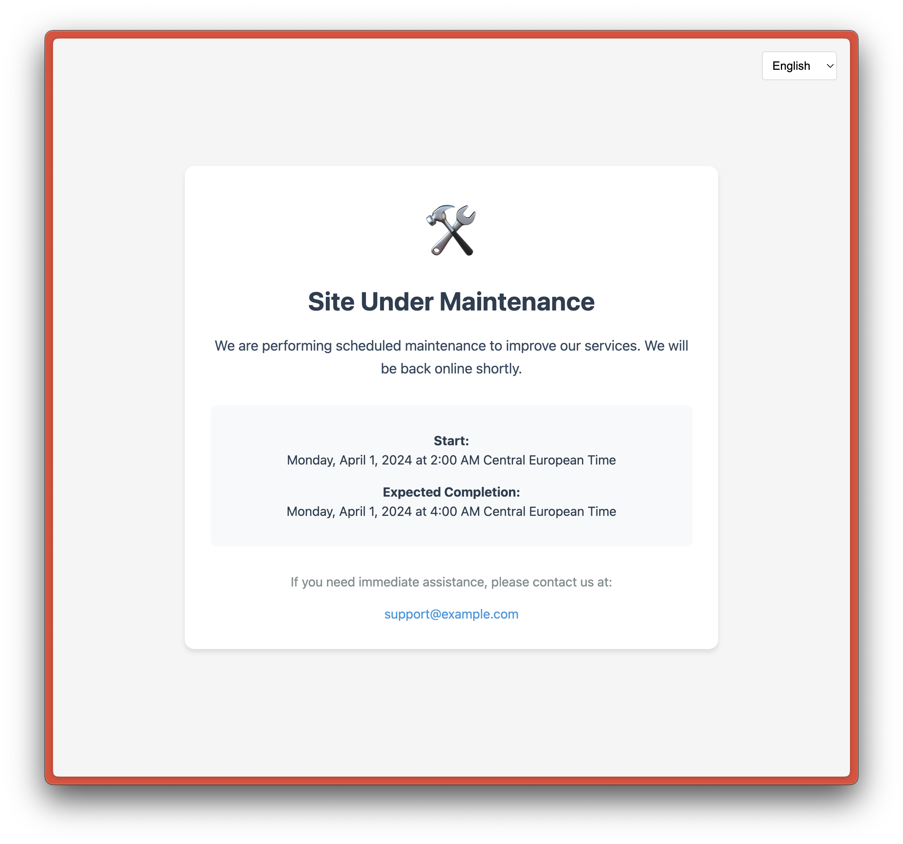

# Maintenance Page Template

A customizable maintenance page built with SvelteKit that supports:

- 🌍 Internationalization (i18n) with English, Spanish, and French
- 🎨 Clean, responsive design
- ⚙️ Environment variable configuration
- 🔄 Real-time language switching



## Features

- Fully customizable through environment variables
- Mobile-responsive design
- Easy to deploy
- TypeScript support
- Accessible UI components

## Environment Variables

Copy `.env.example` to `.env` and customize the following variables:

```env
### --- Dates ---
### The start and end dates can be set to any value that the JS new Date() constructor can parse.
# PUBLIC_MAINTENANCE_START="April 1, 2024 00:00 UTC" # Hidden when empty
# PUBLIC_MAINTENANCE_END="April 1, 2024 02:00 UTC" # Placeholder when empty

### --- Contact ---
### The email address to contact for more information about the maintenance. Hidden when empty.
# PUBLIC_CONTACT_EMAIL="support@example.com"

### --- Title and Description ---
### The title and description of the maintenance. Both are set to a generic placeholder that will be internationalized when not set.
# PUBLIC_MAINTENANCE_TITLE=""
# PUBLIC_MAINTENANCE_DESCRIPTION=""
```

## Development

```bash
# Install dependencies
npm install

# Start development server
npm run dev

# Build for production
npm run build

# Preview production build
npm run preview
```

## Deployment

This is a SvelteKit application that can be deployed to any platform that supports Node.js or static site hosting.

## License

MIT